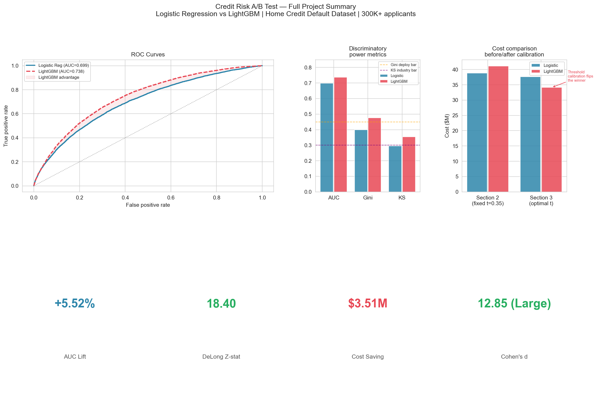

# Credit Risk A/B Test: Logistic Regression vs LightGBM

[](https://credit-risk-api-69lg.onrender.com/docs)
[](https://www.docker.com)
[](https://mlflow.org)
[](https://fastapi.tiangolo.com)

> An end-to-end machine learning A/B testing framework for credit default prediction — comparing a traditional Logistic Regression scorecard against a LightGBM gradient boosting model on 300K+ real loan applicants. Validated with production-grade statistical methods, translated into quantified business impact, and deployed as a live REST API.

**Author:** Siqi Chen | [LinkedIn](https://www.linkedin.com/in/siqi-chen-3159431b6) | siqichen99@gmail.com

---

<p align="center">
  
</p>

---

## Live Demo

**API:** https://credit-risk-api-69lg.onrender.com/docs

The LightGBM model is deployed as a live REST API. Click **POST /predict** → **"Try it out"** → paste applicant JSON → **"Execute"** to receive a real-time default probability, risk tier, and approve/decline decision.

> **Note:** The free-tier instance spins down after inactivity. The first request may take 30–60 seconds (cold start). Open the `/health` endpoint first to warm up the container before a demo.

### Sample prediction — low risk applicant

```json
{
  "AMT_INCOME_TOTAL": 270000, "AMT_CREDIT": 450000, "AMT_ANNUITY": 22500,
  "AMT_GOODS_PRICE": 450000, "DAYS_BIRTH": -16000, "DAYS_EMPLOYED": -3650,
  "DAYS_ID_PUBLISH": -1000, "DAYS_REGISTRATION": -5000,
  "EXT_SOURCE_1": 0.72, "EXT_SOURCE_2": 0.80, "EXT_SOURCE_3": 0.75,
  "NAME_CONTRACT_TYPE": "Cash loans", "CODE_GENDER": "F",
  "FLAG_OWN_CAR": "Y", "FLAG_OWN_REALTY": "Y", "CNT_CHILDREN": 0,
  "NAME_INCOME_TYPE": "Working", "NAME_EDUCATION_TYPE": "Higher education",
  "NAME_FAMILY_STATUS": "Married", "REGION_RATING_CLIENT": 1
}
```

Expected response: `{"default_probability": 0.04, "decision": "Approve", "risk_tier": "Very Low", "threshold_used": 0.168}`

---

## Results at a Glance

| Metric | Model A — Logistic Regression | Model B — LightGBM | Winner |
|---|---|---|---|
| AUC-ROC | 0.6992 | 0.7378 | ✅ LightGBM (+5.52%) |
| Gini Coefficient | 0.3985 | 0.4757 | ✅ LightGBM |
| KS Statistic | 0.2962 | 0.3547 | ✅ LightGBM |
| Recall | 0.8479 | 0.8530 | ✅ LightGBM |
| Precision | 0.1071 | 0.1204 | ✅ LightGBM |
| Optimal Threshold | 0.261 | 0.168 | — |
| Estimated Cost | $37.66M | $34.15M | ✅ LightGBM (-$3.51M) |
| DeLong Z-stat | — | 18.40 | ✅ Significant |
| P-value | — | p < 0.001 | ✅ Reject H₀ |
| Cohen's d | — | 12.85 (Large) | ✅ Large effect |

**Bottom line:** LightGBM at threshold 0.168 reduces estimated credit losses by **$3.51M on the test set (~$11.7M annualized)**, catches 38 more defaults, and approves 6,265 more creditworthy borrowers — validated with the DeLong test (p < 0.001) and 1,000-iteration bootstrap confidence intervals.

---

## Deployment Stack

| Layer | Technology | Details |
|---|---|---|
| REST API | FastAPI | `/predict`, `/predict/batch`, `/health` endpoints |
| Experiment tracking | MLflow | 3 logged runs, model registry with version control |
| Containerization | Docker | Single-command deployment via `docker-compose up` |
| Cloud hosting | Render | Live at credit-risk-api-69lg.onrender.com (free tier) |

### Run the full stack locally

```bash
git clone https://github.com/siqichen99-droid/Credit-Risk-A-B-Test-Logistic-Regression-vs-LightGBM.git
cd Credit-Risk-A-B-Test-Logistic-Regression-vs-LightGBM
docker-compose up
```

| Service | URL |
|---|---|
| API (Swagger UI) | http://127.0.0.1:8000/docs |
| MLflow UI | http://127.0.0.1:5000 |

### API endpoints

| Method | Endpoint | Description |
|---|---|---|
| GET | `/` | Health check — confirms API is online |
| GET | `/health` | Detailed health — confirms model loaded, feature count |
| POST | `/predict` | Single applicant prediction |
| POST | `/predict/batch` | Batch prediction (up to 100 applicants) |

---

## Project Structure

```
Credit-Risk-A-B-Test-Logistic-Regression-vs-LightGBM/
│
├── Notebooks/
│   ├── 01_eda.ipynb                   # Data pipeline, feature engineering, SMOTE
│   ├── 02_models.ipynb                # Model training, SHAP, initial evaluation
│   ├── 03_ab_testing.ipynb            # DeLong test, bootstrap CI, threshold optimization
│   ├── 04_business_dashboard.ipynb    # Business impact, executive summary
│   └── 05_phase2_mlflow.ipynb         # MLflow experiment tracking and model registry
│
├── Models/
│   ├── model_b_lightgbm.pkl           # Production model (LightGBM)
│   ├── model_a_logistic.pkl           # Benchmark model (Logistic Regression)
│   └── scaler.pkl                     # StandardScaler fitted on training data
│
├── Outputs/
│   ├── section3_dashboard.png         # Statistical A/B test results dashboard
│   ├── section4_portfolio_hero.png    # Full project summary (6-panel)
│   ├── section4_business_impact.png   # Cost waterfall + metrics comparison
│   └── section4_risk_segments.png     # Risk segment calibration chart
│
├── Results/
│   ├── phase2_summary.csv             # Section 2 metrics comparison
│   ├── section3_results.csv           # Full statistical test outputs
│   ├── section4_impact.csv            # Annualized financial impact
│   └── feature_cols.txt              # Feature names used in modeling
│
├── mlruns/                            # MLflow experiment tracking data
│
├── Dockerfile                         # Container definition for the API
├── docker-compose.yml                 # Runs API + MLflow together
├── main.py                            # FastAPI application
├── requirements.txt                   # Python dependencies
└── README.md
```

---

## Methodology

### Section 1 — Data & Feature Engineering (`01_eda.ipynb`)

**Dataset:** [Home Credit Default Risk](https://www.kaggle.com/c/home-credit-default-risk) — 307,511 loan applicants, 122 features, 8.1% default rate.

**Feature engineering:** 9 domain-driven financial features constructed from raw columns:

| Feature | Formula | Financial rationale |
|---|---|---|
| `DEBT_TO_INCOME` | AMT_CREDIT / AMT_INCOME | Total loan burden relative to annual earnings |
| `PAYMENT_TO_INCOME` | AMT_ANNUITY / AMT_INCOME | Periodic repayment affordability |
| `LOAN_TO_VALUE` | AMT_CREDIT / AMT_GOODS_PRICE | Collateral coverage — higher LTV signals lower security |
| `CREDIT_TERM` | AMT_CREDIT / AMT_ANNUITY | Effective loan duration in months |
| `AGE_YEARS` | −DAYS_BIRTH / 365 | Applicant age at application date |
| `EMPLOYED_YEARS` | −DAYS_EMPLOYED / 365 | Continuous employment duration |
| `EMPLOYMENT_TO_AGE` | EMPLOYED_YEARS / AGE_YEARS | Career stability relative to life stage |
| `EXT_SOURCE_MEAN` | Mean(EXT_SOURCE_1,2,3) | Composite external bureau credit signal |
| `EXT_SOURCE_MIN` | Min(EXT_SOURCE_1,2,3) | Worst-case bureau signal — captures tail credit risk |

**Class imbalance:** SMOTE (sampling_strategy=0.3) applied to training set only. Test set preserved at the real-world 8.1% default rate.

**Split:** Stratified 70/30 train/test split (seed=42).

---

### Section 2 — Model Development (`02_models.ipynb`)

**Model A — Logistic Regression (Control)**
- Industry standard in credit risk — every coefficient is auditable under SR 11-7
- StandardScaler applied; C=0.1 regularization; class_weight='balanced'
- Coefficients visualized as a credit scorecard

**Model B — LightGBM (Treatment)**
- Gradient boosting; 500 estimators, learning_rate=0.05, early stopping at 50 rounds
- SHAP TreeExplainer applied to 2,000-applicant sample for regulatory explainability
- No feature scaling required

**Key finding:** At a fixed threshold of 0.35, Logistic Regression appeared $2.3M cheaper — an artifact of LightGBM's uncalibrated probability distribution, not a genuine cost advantage. Resolved in Section 3 through independent threshold optimization.

---

### Section 3 — A/B Test Statistical Framework (`03_ab_testing.ipynb`)

#### DeLong Test

| Parameter | Value |
|---|---|
| H₀ | AUC(Model A) = AUC(Model B) |
| H₁ | AUC(Model B) > AUC(Model A) |
| Z-statistic | 18.40 |
| P-value | < 0.001 |
| Decision | **Reject H₀** |

#### Bootstrap Confidence Intervals (1,000 iterations)

| Model | AUC | 95% CI |
|---|---|---|
| Model A — Logistic Regression | 0.6992 | Entirely below Model B |
| Model B — LightGBM | 0.7378 | Entirely above Model A |
| Difference (B − A) | +0.0386 | Entirely above zero |

#### Effect Size

| Metric | Value |
|---|---|
| Pooled std | 0.003005 |
| Cohen's d | **12.85** |
| Classification | **Large** (threshold: > 0.8) |

#### Threshold Optimization

| Model | Optimal Threshold | Minimum Cost |
|---|---|---|
| Model A — Logistic Regression | 0.261 | $37,662,500 |
| Model B — LightGBM | 0.168 | $34,150,000 |
| **Cost saving** | — | **$3,512,500** |

---

### Section 4 — Business Impact (`04_business_dashboard.ipynb`)

#### Performance at Optimal Thresholds

| Metric | Model A (t=0.261) | Model B (t=0.168) | Δ |
|---|---|---|---|
| Defaults caught | 6,315 (84.8%) | 6,353 (85.3%) | +38 |
| Good loans approved | 32,141 | 38,406 | +6,265 |
| Good loans rejected | 52,665 | 46,400 | −6,265 |
| Defaults missed | 1,133 | 1,095 | −38 |
| Total cost | $37,662,500 | $34,150,000 | **−$3,512,500** |

#### Annualized Financial Impact

| Item | Amount |
|---|---|
| Test-set cost saving | $3,512,500 |
| Scale factor (test = 30%) | 3.33× |
| **Estimated annual saving** | **~$11,700,000** |
| Extra defaults caught per year | ~127 |
| Extra good borrowers approved per year | ~20,900 |

#### Cost Decomposition
- **Default loss reduction:** 38 fewer missed defaults × $10,000 = $380,000 (test) | ~$1.3M/yr
- **Revenue recovery:** 6,265 fewer wrongful rejections × $500 = $3,132,500 (test) | ~$10.4M/yr

---

### Section 5 — MLflow Experiment Tracking (`05_phase2_mlflow.ipynb`)

Three runs logged to the `credit_risk_ab_test` experiment:

| Run | Contents |
|---|---|
| `model_a_logistic_regression` | Parameters, 13 metrics, model artifact, tags |
| `model_b_lightgbm` | Parameters, 17 metrics (incl. DeLong + cost saving), model artifact |
| `ab_test_statistical_validation` | DeLong test results, threshold optimization outputs |

Both models registered in the MLflow Model Registry: `credit_risk_lightgbm v1` and `credit_risk_logistic_regression v1`.

---

## How to Reproduce

### Option A — Docker (recommended)

```bash
git clone https://github.com/siqichen99-droid/Credit-Risk-A-B-Test-Logistic-Regression-vs-LightGBM.git
cd Credit-Risk-A-B-Test-Logistic-Regression-vs-LightGBM
docker-compose up
```

### Option B — Local Python environment

```bash
# Create virtual environment
python -m venv venv
venv\Scripts\activate          # Windows
source venv/bin/activate       # Mac/Linux

# Install dependencies
pip install numpy pandas scikit-learn lightgbm imbalanced-learn shap \
            matplotlib seaborn scipy jupyter ipykernel joblib fastapi \
            uvicorn mlflow

# Download dataset
# Go to https://www.kaggle.com/c/home-credit-default-risk/data
# Download application_train.csv into the Data/ folder

# Run notebooks in order
# 01_eda.ipynb → 02_models.ipynb → 03_ab_testing.ipynb
# → 04_business_dashboard.ipynb → 05_phase2_mlflow.ipynb

# Start the API
python -m uvicorn main:app --reload

# Start MLflow UI (separate terminal)
python -m mlflow ui --port 5000
```

---

## Tech Stack

| Category | Libraries |
|---|---|
| Data processing | pandas, numpy |
| Machine learning | scikit-learn, LightGBM |
| Explainability | SHAP |
| Class imbalance | imbalanced-learn (SMOTE) |
| Statistical testing | scipy (DeLong, bootstrap) |
| Experiment tracking | MLflow |
| REST API | FastAPI, uvicorn |
| Containerization | Docker, docker-compose |
| Visualization | matplotlib, seaborn |
| Environment | Python 3.11, Jupyter, VS Code |

---

## Skills Demonstrated

**Statistical rigor** — DeLong test for correlated AUC comparison; bootstrap confidence intervals; Cohen's d effect size; p-value interpretation at scale

**Credit risk domain knowledge** — Gini coefficient; KS statistic; scorecard methodology; asymmetric cost modeling; LTV, DTI, and bureau score feature engineering; SOX compliance awareness

**ML engineering** — gradient boosting; SMOTE; early stopping; SHAP explainability; threshold calibration; model serialization

**MLOps** — MLflow experiment tracking; model registry with versioning; Docker containerization; cloud deployment on Render; REST API with FastAPI

**Business translation** — cost-sensitive evaluation; annualized impact projections; risk segment calibration; executive summary development; deployment recommendation framing

---

## Resume Bullet

> *Developed end-to-end credit risk A/B testing framework and deployed as a live REST API — FastAPI + Docker + Render at https://credit-risk-api-69lg.onrender.com; LightGBM vs Logistic Regression on 300K+ loan applicants, DeLong test Z=18.40 p<0.001, ~$11.7M projected annual loss reduction; experiment tracking and model versioning via MLflow.*

---

## License

MIT License — free to use and adapt with attribution.
